::: {.callout-note appearance="simple"}
**Status: loader built; code published, data not.** The bulk PSC loader is built and merged
(Stage 1 and the companies-per-person usability check are done). By decision the project publishes
**code and these aggregate summaries only** — never the PSC data itself, which is personal data you
download from Companies House yourself. The figures below are static, pre-computed summaries written
by `scripts/psc_site_summaries.py`; this page runs no code and renders with no raw or Parquet data
present.
:::

## Summary

"PSC" means *persons with significant control* — the people or entities that own or control a UK
company. "Significant" means, roughly, **more than 25%** of the shares or votes, or the right to
appoint most of the board. The register began in **April 2016**. Companies House publishes a daily
bulk snapshot; this project analysed the 2026-09-18 snapshot (about 16 million records) end to end.
It is rich enough to support company-level ownership features, but it is personal data, has **no
stable identifier for a person**, and its structure is full of traps — so the project ships code and
company-level aggregates only, keeps any person-level table private, and states match confidence
honestly rather than imply a clean ownership graph.

**Two populations — the figures below are shown for both, because the counts differ:**

- **All records in the product (an "ever" view).** Every PSC line ever filed, including *ceased*
  control and companies now dissolved. Good for history; it roughly doubles "how many" counts. The
  product holds **10,917,257 distinct companies — nearly twice the live register.**
- **Live companies only (as of 2026-09-01).** Records whose company is on the Basic Company Data
  register. There is no mid-month register product, so the nearest monthly register to the
  2026-09-18 PSC snapshot is **2026-09-01 — 17 days earlier**; the live figures carry that gap.
  **[Checked]**

Companies-per-person is shown **only as banded aggregates, never as a person identity** (see below).

## Coverage

| metric | value |
|---|---:|
| PSC snapshot date | 2026-09-18 |
| register used for "live" figures | 2026-09-01 (17 days earlier) |
| lines in the snapshot | 15,952,486 |
| PSC records (excluding the totals line) | 15,952,485 |
| distinct companies in the product (ever) | 10,917,257 |
| companies with an active PSC or statement | 10,854,237 |
| live companies on the register | 5,689,366 |
| live companies matched in the product | 5,536,905 (97.3% of the live register) |
| totals line — PSCs / statements / exemptions | 15,029,813 / 922,564 / 108 |

The totals line (Companies House's own counts) **reconciles exactly** with the parsed counts.
Source: `docs/site/datasets/psc-assets/coverage.csv` (from the loader's `load_report.json` and
`psc_totals.json`); `docs/AUDIT.md` (PSC loader Stage-1). **[Checked]**

**2.7% of live companies have no PSC record** (152,461 of 5,689,366 live companies are not matched in
the product). The cause is **not verified** — it could be genuine "no registrable person" cases,
exempt company types, or filing gaps. **[Not verified]**

## Figures

Static summaries in `psc-assets/`, aggregates only, small counts (<10) rendered `<10` in the CSVs
and never drawn.

### Records by kind

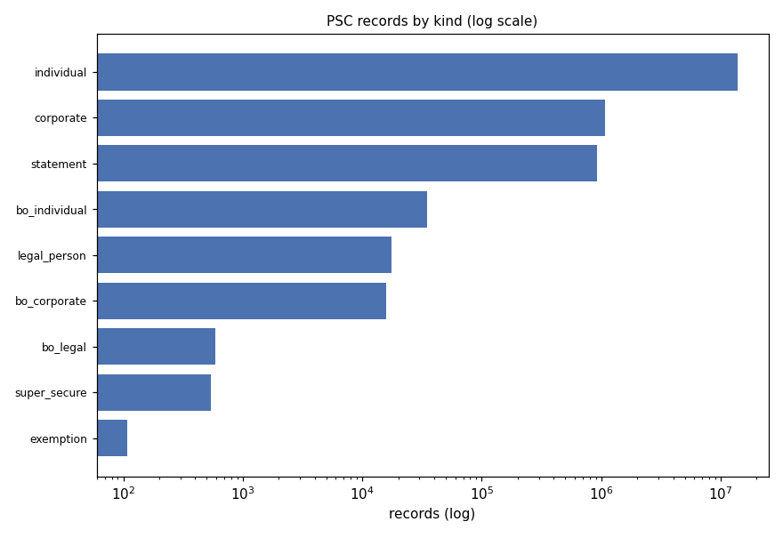

`bo_*` are **overseas-entity beneficial owners** — the separate Register of Overseas Entities
regime, not the ordinary PSC regime. Source: `psc-assets/01_records_by_kind.csv`. **[Checked]**

### Active vs ceased

::: {layout-ncol=2}
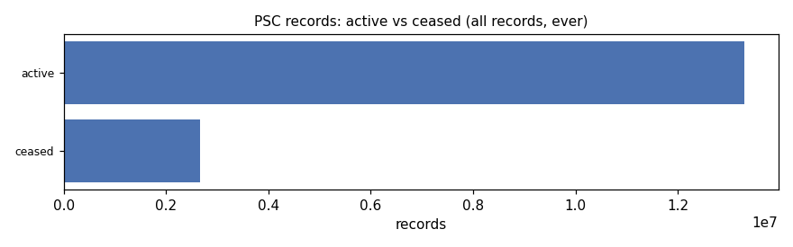

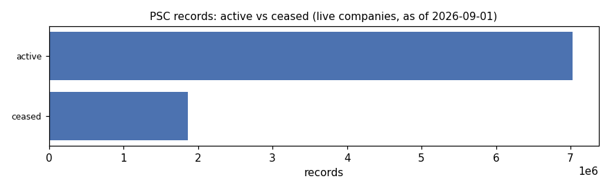
:::

16.6% of all records are ceased; restricting to live companies removes dead-company history.
Source: `psc-assets/02_active_vs_ceased.csv`, `..._live.csv`. **[Checked]**

### Nature-of-control core rights

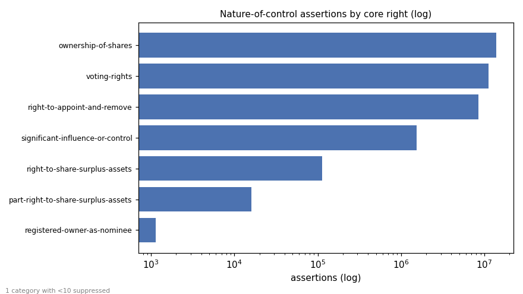

A single record can hold **several** rights, so assertions (35,169,887) far exceed records. Core
rights are counted after stripping entity-type suffixes (trust / firm / LLP / overseas-entity and
their compounds). "empty nature value" is a null array element (**1 category suppressed, <10**).
Source: `psc-assets/03_noc_cores.csv`. **[Checked]**

### PSC information state per company

::: {layout-ncol=2}
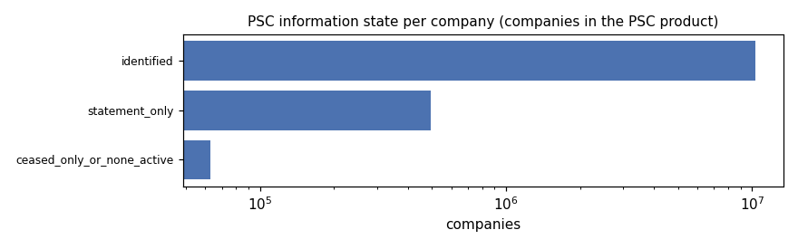

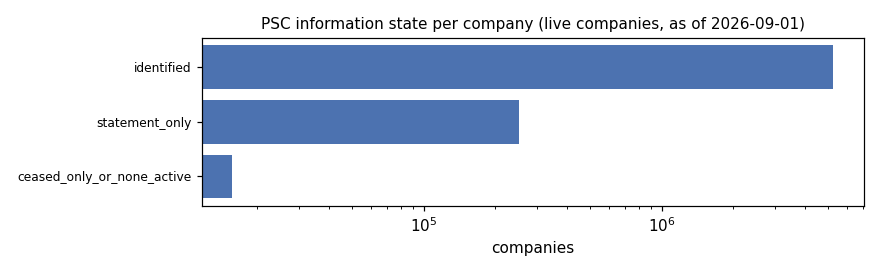
:::

Per company: *identified* (≥1 active person/corporate PSC), *statement_only* (no active PSC but an
active statement), or *ceased-only / none active*. Source:
`psc-assets/04_info_state_per_company.csv`, `..._live.csv`. **[Checked]**

### Control start year, active vs ceased

::: {layout-ncol=2}
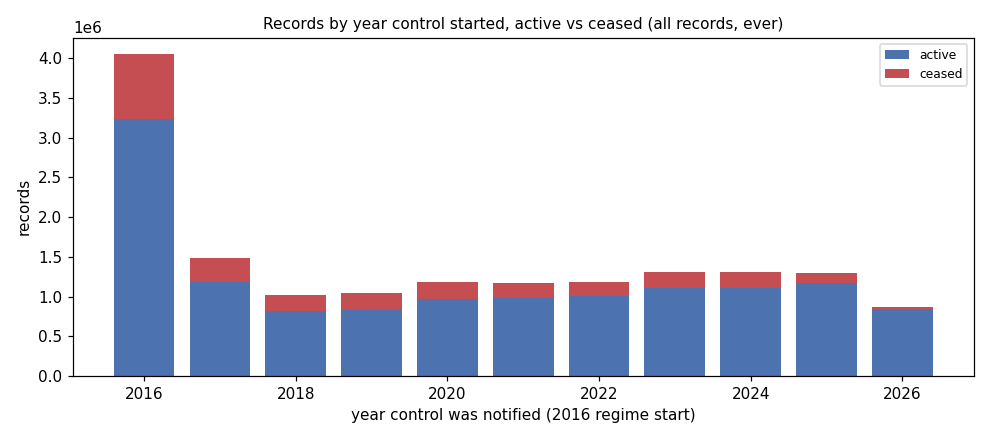

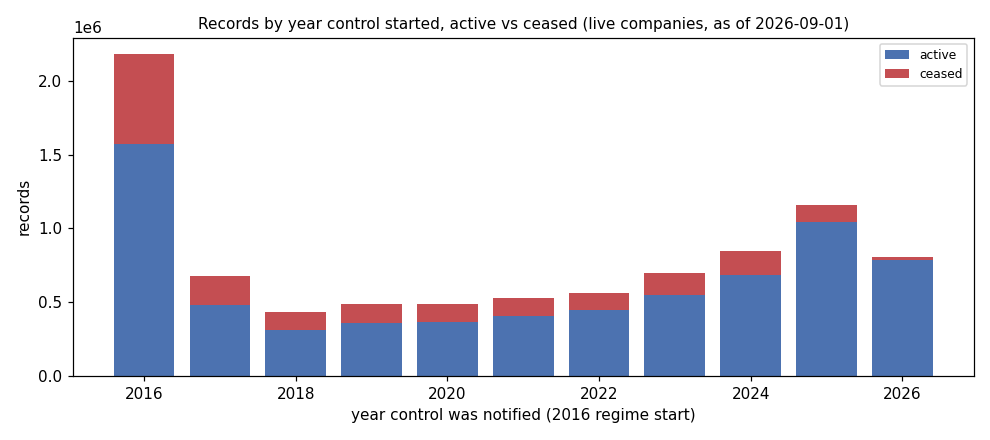
:::

The 2016 spike is the regime start (existing companies declaring control at once). Source:
`psc-assets/08_control_start_year.csv`, `..._live.csv`. **[Checked]**

### Active statement codes

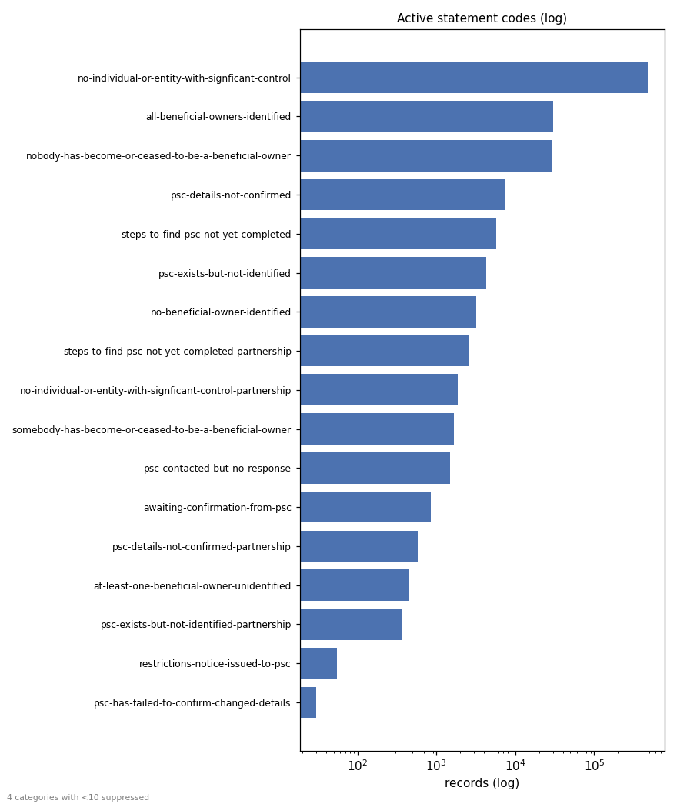

Codes are reproduced **verbatim** — `no-individual-or-entity-with-signficant-control` is Companies
House's own spelling of "significant" (not a typo on this page). **4 rare codes suppressed (<10).**
The three unresolved-owner codes (`psc-details-not-confirmed`, `steps-to-find-psc-not-yet-completed`,
`psc-exists-but-not-identified`) are what the `PSC_UNRESOLVED` indicator keys off. Source:
`psc-assets/09_active_statement_codes.csv`. **[Checked]**

### ECCTA identity verification

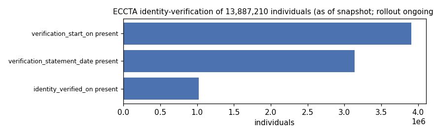

Counts are **as of the snapshot; the ECCTA identity-verification rollout is ongoing**, so these are
lower bounds that will rise. Source: `psc-assets/07_eccta_verification.csv`. **[Checked]**

### Companies per person (banded)

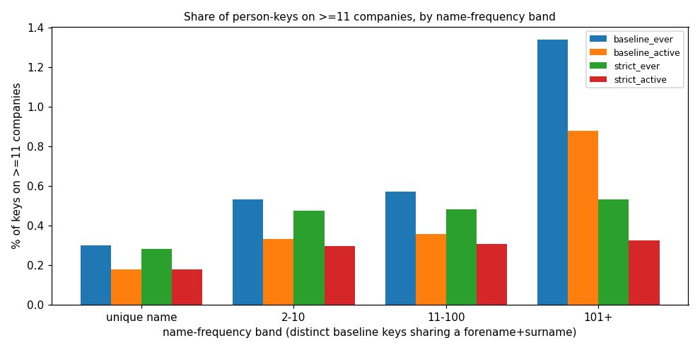

This is shown **only as banded aggregates, never as a person identity.** There is no stable person
id, so a "person" is a fuzzy key: a *baseline* key (forename + surname + birth year + month) or a
*strict* key that also includes the middle name. From the usability check
(`docs/psc-checks-results.md`):

- **≤2.07% of baseline keys (4.91% of records) show a detectable split** — a baseline key resolving
  into more than one strict key (a bound on detectable splits, not on all collisions).
- **the strict key's 53% coverage is a non-random subset** (middle-name recording correlates with
  record vintage), so strict figures are a precision check, not a population rate.
- **"active-only" and "ever" are shown separately** (the chart plots both), because "ever"
  accumulates dissolved shells — 51% of the companies behind the high-count tail are dissolved.

Source: `docs/psc-checks-results.md`, `psc-assets/06_companies_per_person_bands.csv`. **[Checked]**

## What you can and can't answer

**You can** (read straight from the file, reliable):

- Does the company name a controller, or file a statement instead (e.g. "no one has more than 25%")?
- How is control shaped — one 75–100% owner, several people, another company? (bands only)
- Is it owned by another company, and is that parent live? **77.9%** of corporate owners with a
  registration number link to a live company. **[Checked]** (`docs/recon-psc-results.md`; measured
  against the 2026-08-01 register, ~7 weeks older than the snapshot).

**You can't:**

- exact ownership percentages (only bands such as 25–50%), or owners below 25%
- full dates of birth, or home addresses
- who the legal shareholders are
- what the file looked like on a day nobody saved

**Only with honest uncertainty:** whether a company's controllers also control many others
(companies-per-person) — reported banded, with the split bound above, never as a person identity.

## Data governance

*Reproduced verbatim from `docs/psc-data-guide.md` §5.*

This project publishes **code, not PSC data**. Anyone who runs the code downloads the file from
Companies House themselves and is responsible for how they use it. The points below are there so
users know what they are handling.

- **It is personal data.** The file holds names, month and year of birth, nationality, country of
  residence and a correspondence address for about 14 million people.
  - Public availability on Companies House does not remove data-protection duties.
  - Under UK GDPR, anyone storing or analysing it needs a lawful basis and a sensible retention
    period.
- **Nationality and age are sensitive.** This project does not use nationality as a feature,
  because it risks discriminatory outcomes (Equality Act principles). Age is kept only as 5-year
  bands in private tables and is never an indicator. Users building their own features should
  think hard before doing otherwise.
- **Aggregates can identify people.** "The controller of this company also controls 40 others"
  points at a named person when the company has a single PSC. The same applies to small counts in
  a breakdown, such as 3 PSCs resident in a given country in a given sector.
- **Some records are protected.** Super-secure records are withheld to protect people at risk. Do
  not try to fill them in from other sources.
- **Matching creates new information.** Linking records into "likely the same person" produces a
  profile that no single Companies House record contains. Treat matched outputs as more sensitive
  than the source.
- **In this project's docs**, all examples are invented or obfuscated, and published breakdowns
  suppress small counts.

## Follow-ups

- **Notification lag is deferred this pass.** The meaning of `notified_on` (date control *began* vs
  date the company *told* Companies House) is unsettled and needs the API documentation, so the lag
  figure is not shown here. The script still emits `psc-assets/05_notification_lag.csv` for when the
  semantics are resolved. **[Not verified]**
- **Live figures use the 2026-09-01 register** (17 days before the snapshot); production should pair
  same-day snapshots or state the gap.

## Details: what the recon found

The recon ran over **all 32 parts of the 2026-09-18 snapshot — 15,952,486 records, 0 bad lines**,
in 404 seconds, joined against the 2026-08-01 Basic Company Data. Every figure here traces to
`docs/recon-psc-results.md` / `docs/recon-psc-results.json`; the full write-up is
`docs/recon-psc.md`. **[Checked]** (project measurement).

- **History is reconstructable from 2016-04-06.** Ceased PSC records are retained — 2,655,316
  records (16.6%) carry a `ceased_on` date. 62,986 companies appear only as ceased records.
- **Statements exist, segregated at the tail.** 922,564 records (5.8%) are statement records, all in
  parts 31–32. Parts 1–30 genuinely contain none.
- **Partitioning is meaningless.** Every part spans essentially the whole register. **Stream all
  parts.**
- **Corporate PSCs.** A registration number is present on 91.0%, of which 77.9% resolve to a live
  company — a usable company-to-company ownership edge.
- **Natures of control.** 35,169,887 assertions. The authoritative enumeration has **86 codes**,
  which reduce to **7 core rights / 24 suffix-stripped bases** once the full suffix set (including
  compound suffixes) is removed — the recon's earlier "55" used a single-suffix definition. Source:
  `docs/psc-checks-results.md`, `tests/fixtures/psc_descriptions_natures.yml`. **[Checked]**

### Data-quality traps

- **No stable person ID.** Linking the same person across companies is a fuzzy join (see the banded
  companies-per-person figure). On the baseline key, **28.8%** of keys appear on ≥2 records and
  **28.0%** on ≥2 distinct companies (an "ever" figure). See [pitfalls](../guide/pitfalls.qmd).
- **Dirty dates.** 14,554 records have `ceased_on` before `notified_on`; 23,916 `notified_on` dates
  predate the 2016 regime (min `1083-01-01`); **272** `ceased_on` dates fall outside 2016–2026 (269
  before 2016; 3 after: `2924`, `9998`, `9999`); 17,729 individuals imply an age under 16 at
  notification. Source: `docs/recon-psc-results.json`; loader `f_ceased_out_of_range` agrees
  (`docs/AUDIT.md`). **[Checked]**
- **One-shot snapshot.** Only today's file is served; corrections over time are lost unless you
  archive snapshots yourself.

### Design decisions that follow

- **Code only, never the data.** The repository ships the extractor and methodology only.
- **Private person table, public per-company aggregates.** Any person-level linkage table stays
  private; only company-level aggregates (like those above) are published.
- **Nationality excluded.** Measured for data-quality documentation only, excluded from any product.
- **Honest match confidence.** Any companies-per-person statistic carries its matching method and
  confidence, never a settled fact.

### Prior work to build on

- **Global Witness + DataKind UK**, "The Companies We Keep" (2018) — matched people on name + birth
  month/year + address; the natural benchmark for this project's person matching.
- **Open Ownership** — its `bods-uk-psc-pipeline` publishes UK ownership in the Beneficial Ownership
  Data Standard.
- **OpenSanctions** — its `gb-coh-psc` converter turns Companies House ownership data into a standard
  graph format.

### Where to go next

- [How the sources join](../guide/sources-map.qmd) — where PSC sits among the UK sources.
- [Pitfalls](../guide/pitfalls.qmd) — the PSC-specific traps.
- [Prior work](../evidence/prior-work.qmd) — what others have built with PSC data.
